# E-commerce Application 🛍
- Flutter Ecommerce mobile app using API with many functionalities such as search for products by title and category, manage favorite item 
  and cart.
- BloC state management used to manage app's business logic.

## Note
This repository is still under development and I will continue to add more features to it.

## ✨ Features
- Easy to use
- login and sign up user
- Filter products by category and title.
- Add/Remove products from the favorite products list.
- Cart management.
- Check the internet connection status.
- Dark mode (Coming Soon!)
- other features (Coming Soon!)

## 🔌 Packages
- flutter_bloc
- dio
- flutter_animate
- flutter_offline
- shared_preferences
- flutter_screenutil
- shimmer
- persistent_bottom_nav_bar
- flutter_svg

## 📸 ScreenShots
| Ecommerce                                      | Application                                |
| -----------------------------------------      | -------------------------------------------|
| 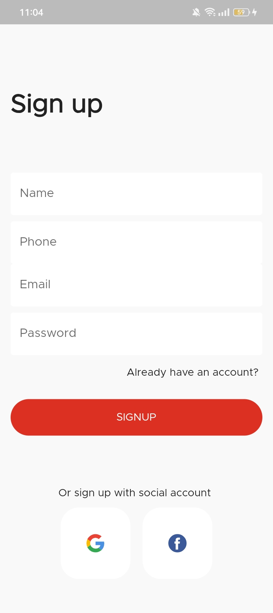      | 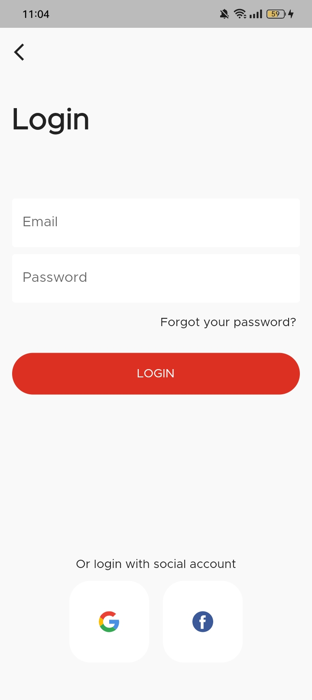  |
| 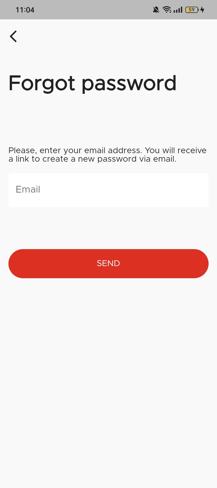      | 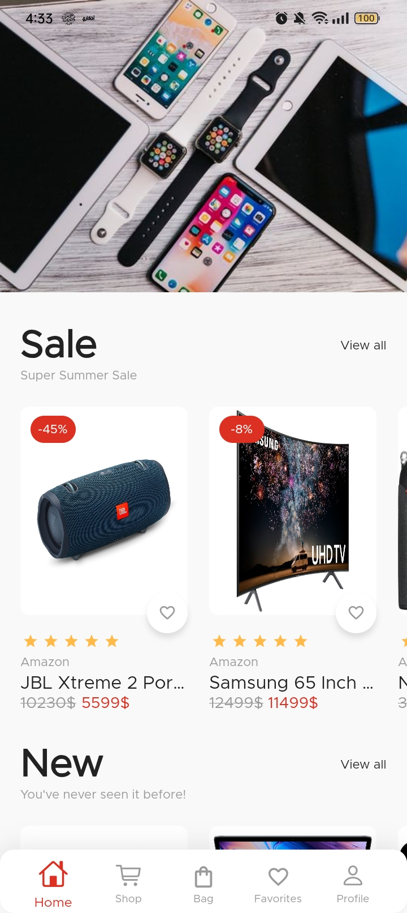  |
| 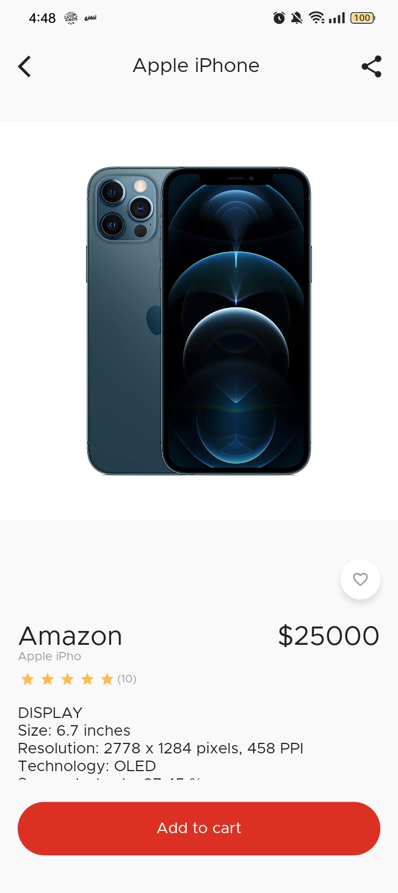      | 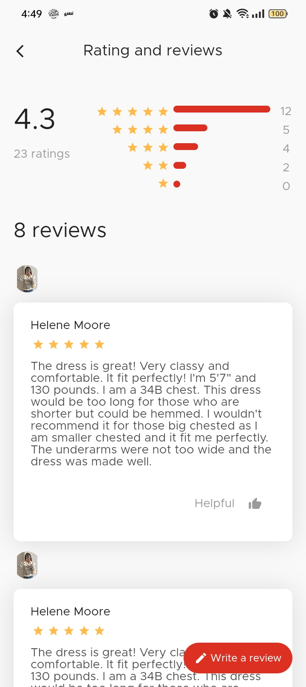  |
| 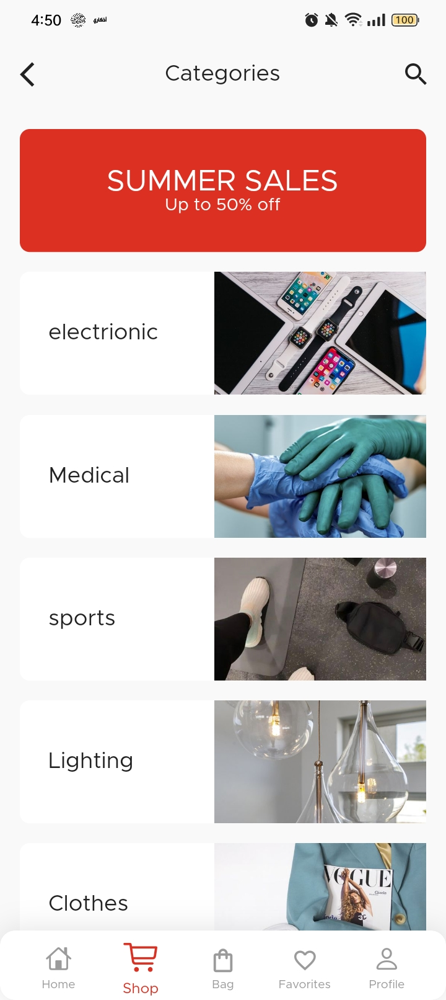      | 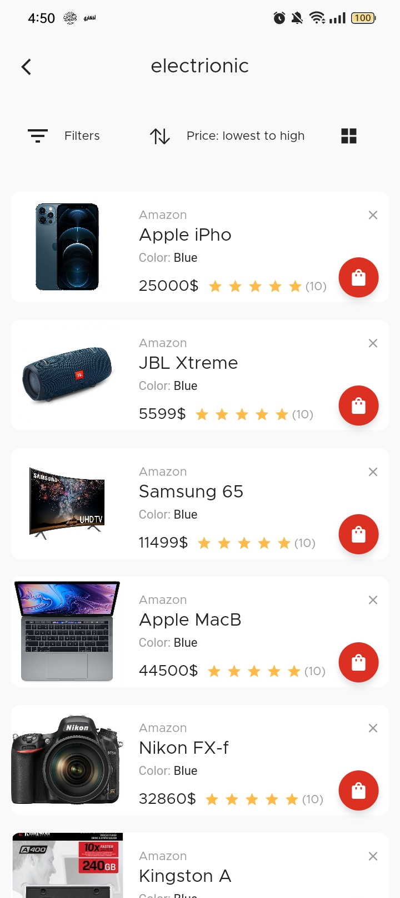  |
| 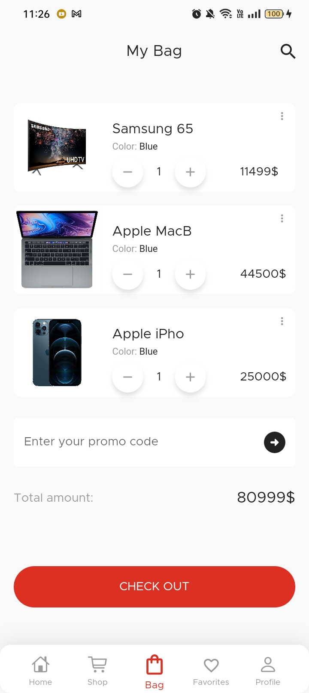      | 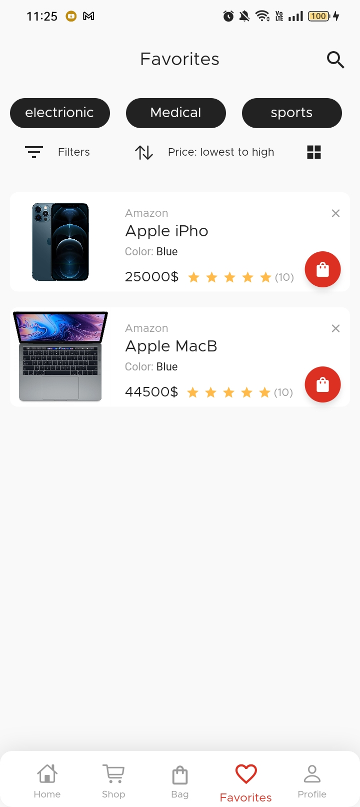 |
| 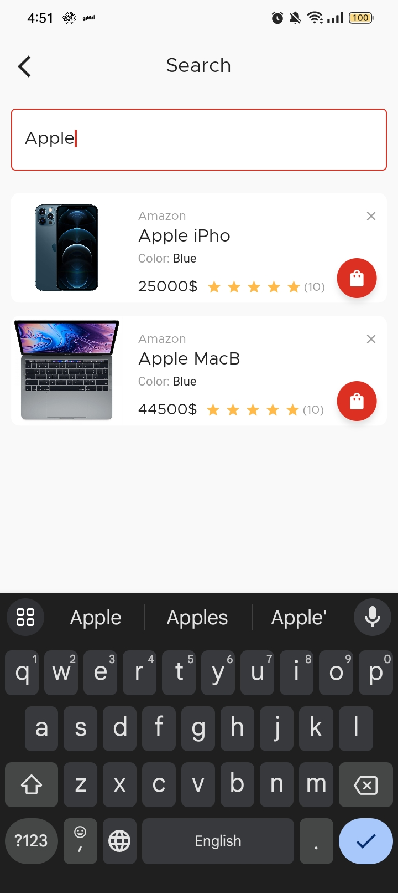     | 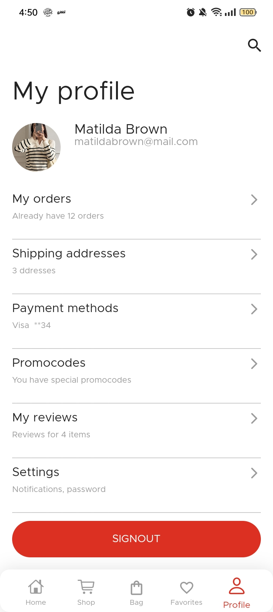 |
| 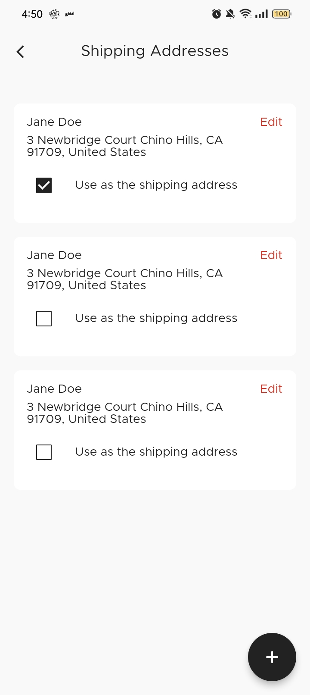     | 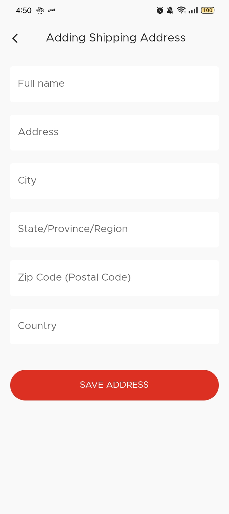 |
| 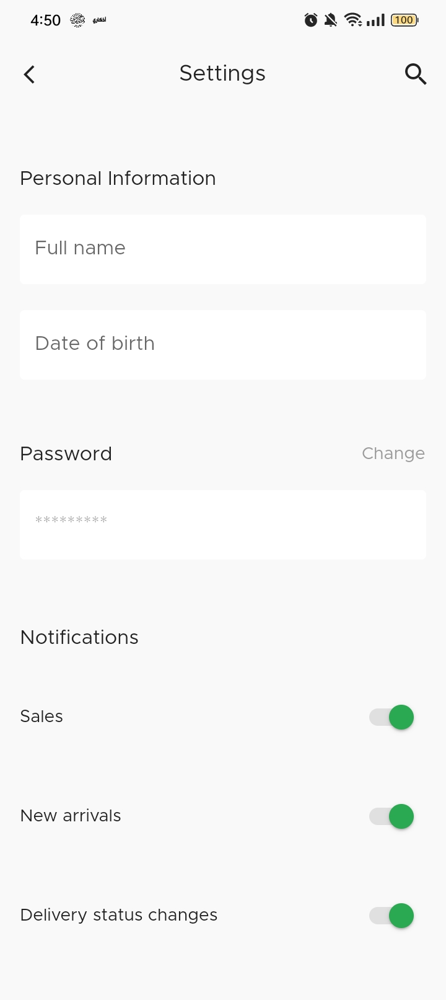     | 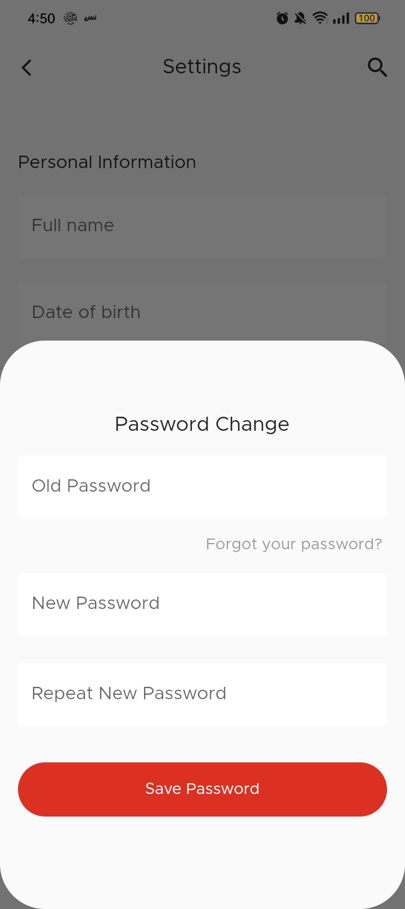 |
| 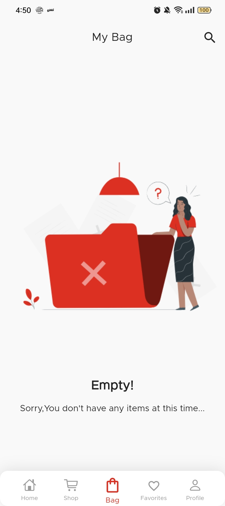     | 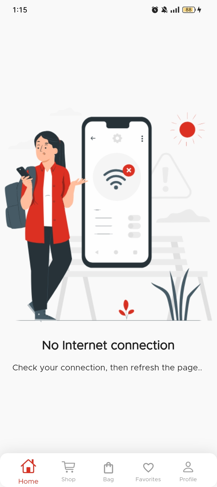 |

## 🎥 [Video](https://drive.google.com/file/d/1wNG3PG1jQGXtw2r2lSM72VqZe6WwuiRx/view?usp=sharing)
<!---
|Video                                          |
|-----------------------------------------------|
| <video src="https://github.com/salsabilelshiekh2022/E-commerce_application/blob/main/screen_shot/record.mp4" width=300>|
-->

  
